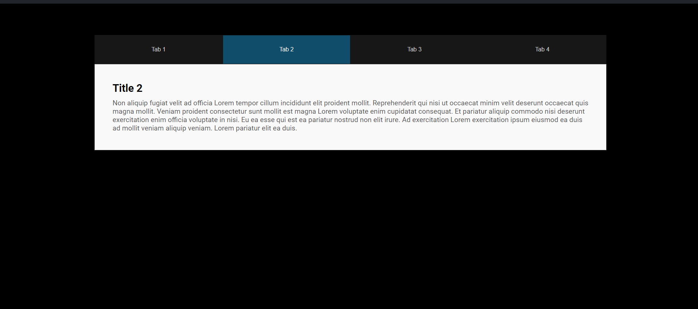

# React Tabs Component

This project is a simple and customizable React component that allows users to toggle between different tabs. Each tab displays unique content, making it a useful component for displaying organized information in your application.



## Features

- Dynamic tab creation based on data.
- Ability to customize tab titles, titles, and content.
- Simple toggle feature that sets active tabs with visual feedback.

## Project Structure

The main component is defined in `Tabs.js`, containing a list of tabs and associated content. The component uses React's `useState` hook to manage active tabs and display content based on the selected tab.

## Installation

1. **Clone the repository**:

   ```bash
   git clone https://github.com/asero13th/react-tabs
   cd react-tabs
   ```

2. **Install dependencies**:

   ```bash
   npm install
   ```

3. **Run the project**:
   ```bash
   npm start
   ```

## Usage

The `Tabs` component takes no props in this version, and the content and tab data are defined within the component. It can be imported and used directly in your application as follows:

```javascript
import Tabs from "./path/to/Tabs";

function App() {
  return (
    <div>
      <h1>My Tabs Component</h1>
      <Tabs />
    </div>
  );
}

export default App;
```
